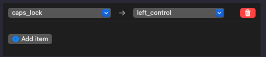

# my-keyboard-setting

このレポジトリは，JIS配列のMacBookとUS配列の外付けキーボードを共存させるための
Karabiner-Elementsの設定ファイルがあります．

## 環境
- Macbook JIS配列
- Keychron K12 (外付けキーボード)
- VMware Horizon View (Windows 10, JIS設定)

## できること
- kana_eng.json
  - JIS配列MacBookのように「英/かな」をそれぞれ左右commandで変更できます．  
    (従来の「[For Japanese （日本語環境向けの設定） (rev 6)](https://ke-complex-modifications.pqrs.org/#japanese)」をVMware以外のアプリケーションで(つまり，VMwareを使っていないときに)動くように改変しています)
- us2jis.json
  - VMware Horizon Viewの使用時に，手元のUSキーボートをJIS配列に変換して
送信することによって仮想環境上でもUS配列が使えます．
つまりVM上のレジストリとかをいじらないでもできます．
- emacser.json
  - VMware Horizon Viewの使用時に，以下のemacsキーバインドが仮想環境で使用できます．
    - 行頭 (ctl-a)
	- 行末 (ctl-a)
	- 前後上下 (ctl-b,f,p,n)
	- 削除 (ctl-d,h)

## 使用方法
- ```~/.config/karabiner/assets/complex_modifications```へJSONを配置します．
- キーボードのvendor_idをそれぞれ変更する必要があります．
  ```
  "identifiers": [
    {
        "vendor_id": 1452,
        "product_id": 591
    }
  ]
  ```

- MacOSの環境設定で，Caps lockをcontrolに変更する．
- KarabinereのSimple Modificationsで"caps_lock -> left_control"の設定をする．


## Future work
- windows上で基本的なemacsキーバインドが使えるようにする

## このレポジトリは以下を参考に改変したものです．
- [Karabiner-Elementsで仮想WindowsのJIS配列をMacbookのUS(ANSI)配列で入力できるようにする](https://qiita.com/imoris/items/14442ba5e7bfb8282978)
- [For Japanese （日本語環境向けの設定） (rev 6)](https://ke-complex-modifications.pqrs.org/#japanese)


